<div align="center">

# 🎟️ EventEase

### College event registration, QR check-in and AI reminder calls — in one place

**Register fast. Scan once. Zero duplicates.**

[](https://event-ease-zeta-sage.vercel.app/)


<br/>


<br/>

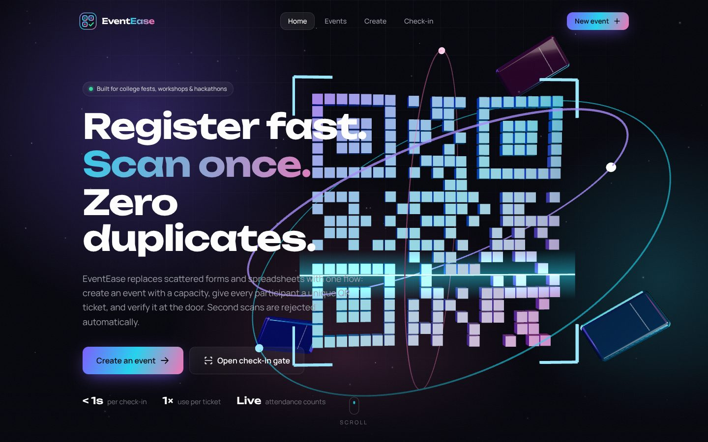

</div>

---

## 📊 At a glance

<div align="center">

|  ⚡ Check-in  |    🎫 Uses per ticket     |     🗣️ Call languages      |  ⏱️ Every reminder call   | 🔐 Possible entry codes |
| :-----------: | :-----------------------: | :------------------------: | :-----------------------: | :---------------------: |
|   **< 1 s**   |          **1×**           |           **3**            |        **≤ 20 s**         |    **≈ 8.5 × 10¹¹**     |
| per gate scan | a second scan is rejected | Gujarati · Hindi · English | cut off by the phone line |   typo-proof alphabet   |

</div>

## 📚 Contents

- [The problem](#-the-problem)
- [Screenshots](#-screenshots)
- [Features](#-features)
- [How it works](#-how-it-works) · [Architecture](#-architecture) · [Check-in](#-check-in-exactly-once)
- [Aanaya — AI reminder calls](#-aanaya--ai-reminder-calls)
- [Data model](#-data-model)
- [Tech stack](#-tech-stack)
- [Quick start](#-quick-start) · [Local development with calls](#-local-development-with-reminder-calls)
- [Demo script](#-demo-script-3-minutes)
- [REST API](#-rest-api)
- [Testing](#-testing)
- [Project structure](#-project-structure) · [Scripts](#-scripts) · [Notes](#-notes) · [Roadmap](#-roadmap)

---

## 🎯 The problem

Most college fests run on a **Google Form** for sign-ups and a **spreadsheet at the door**.

| 😩 Today                                                   | ✅ With EventEase                                                    |
| ---------------------------------------------------------- | -------------------------------------------------------------------- |
| The same student registers twice; one ticket gets in twice | One ticket per account per event; a second scan is **rejected**      |
| Volunteers search a sheet for every name (≈ 30 s each)     | Scan a QR or type a code — **under a second**                        |
| Forms keep accepting sign-ups after seats run out          | Capacity is **enforced in the database**, even under a rush          |
| Nobody knows who arrived until it's over                   | **Live dashboard**: registered, checked in, seats left, gate results |
| Reminders go out by hand, so seats sit empty               | **Aanaya** phones every registrant before the start                  |

> Checking in 500 students by hand at 30 s each takes about **4 hours**. At under a second per scan it takes under **9 minutes**.

---

## 📸 Screenshots

| ✅ Gate: first scan                                    | ⛔ Gate: same code again                                      |
| ------------------------------------------------------ | ------------------------------------------------------------- |
| 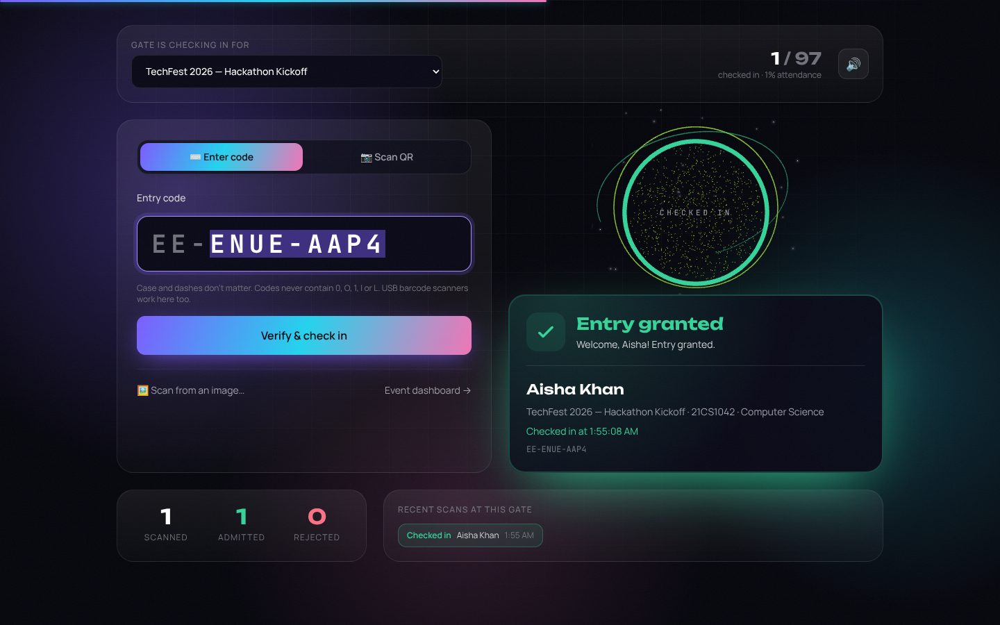 | 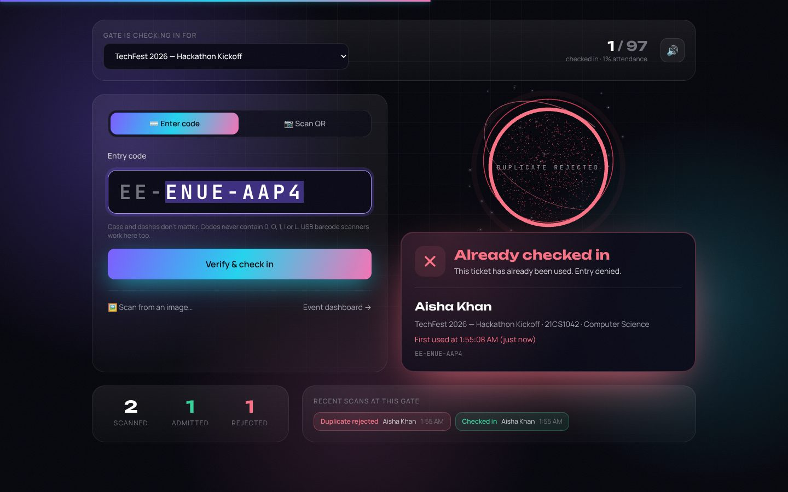 |

| 🎫 Holographic QR ticket               | 📈 Live event dashboard                      |
| -------------------------------------- | -------------------------------------------- |
| 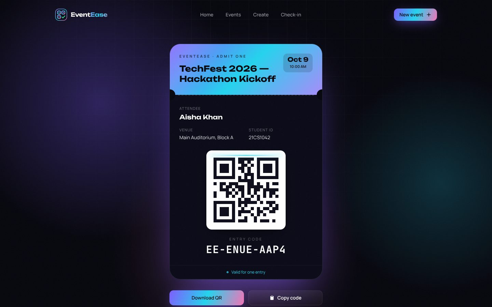 | 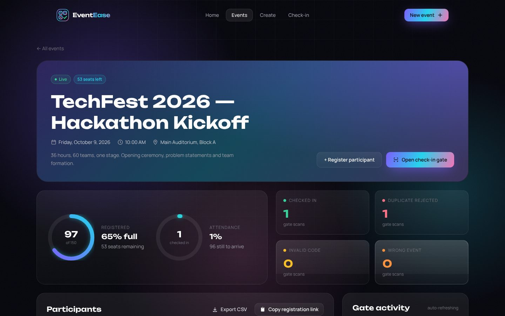 |

| 🛠️ Create an event, with a live preview                 | 📝 Registration page: type, fee, prizes, call language |
| ------------------------------------------------------- | ------------------------------------------------------ |
| 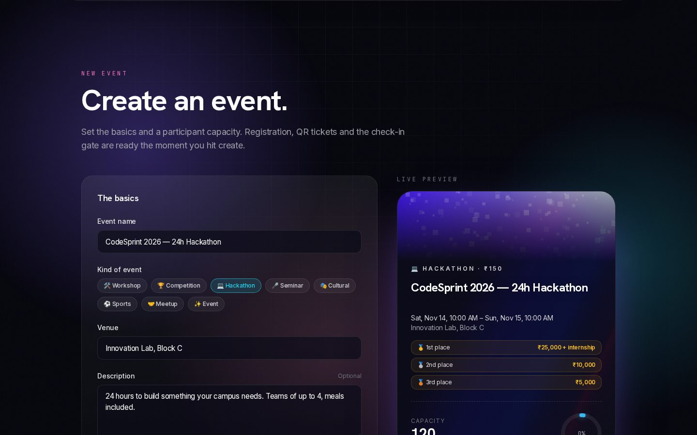 | 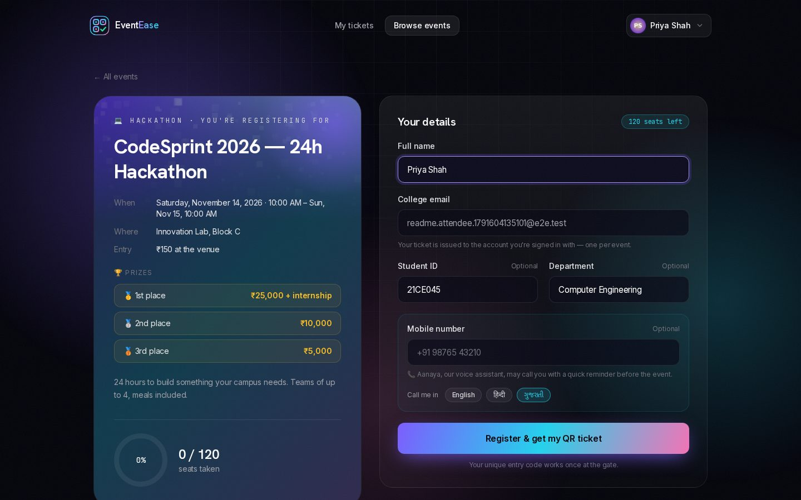    |

| 👤 Rich profile with a live card              | 🏆 Event dashboard: cover, time range, prizes        |
| --------------------------------------------- | ---------------------------------------------------- |
| 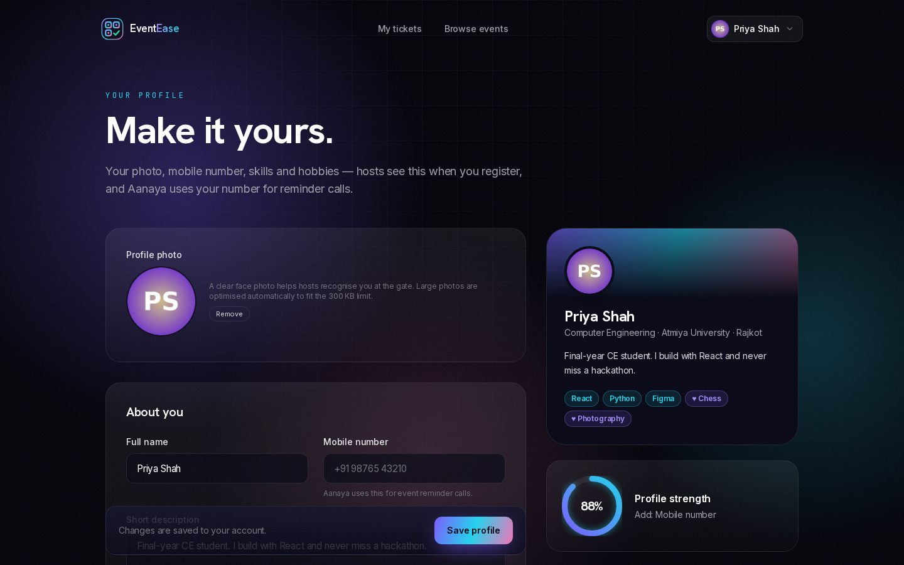 | 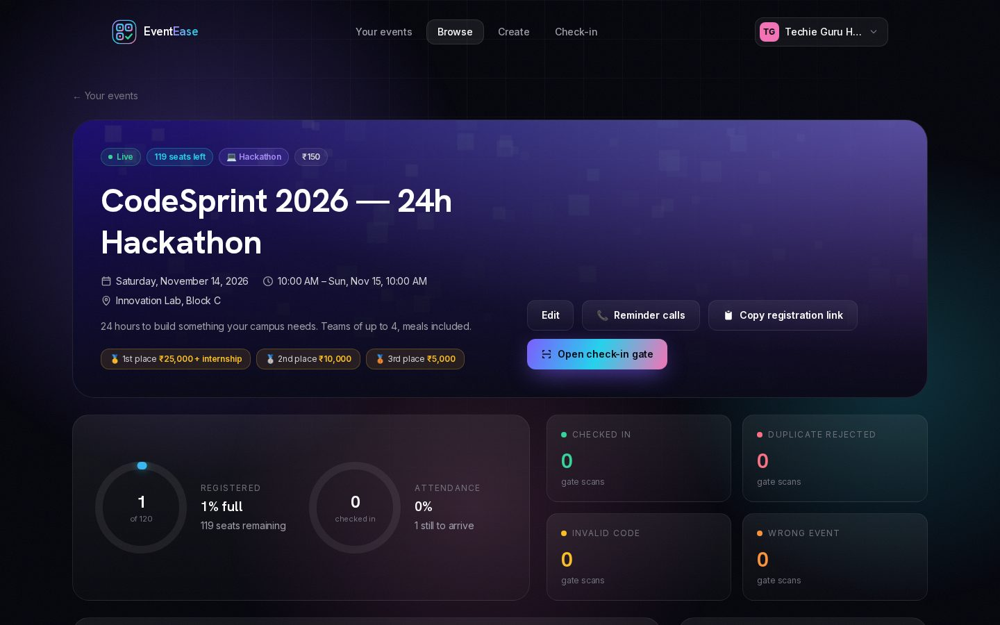 |

<details>
<summary><b>📞 Aanaya's call console</b> (click to expand)</summary>

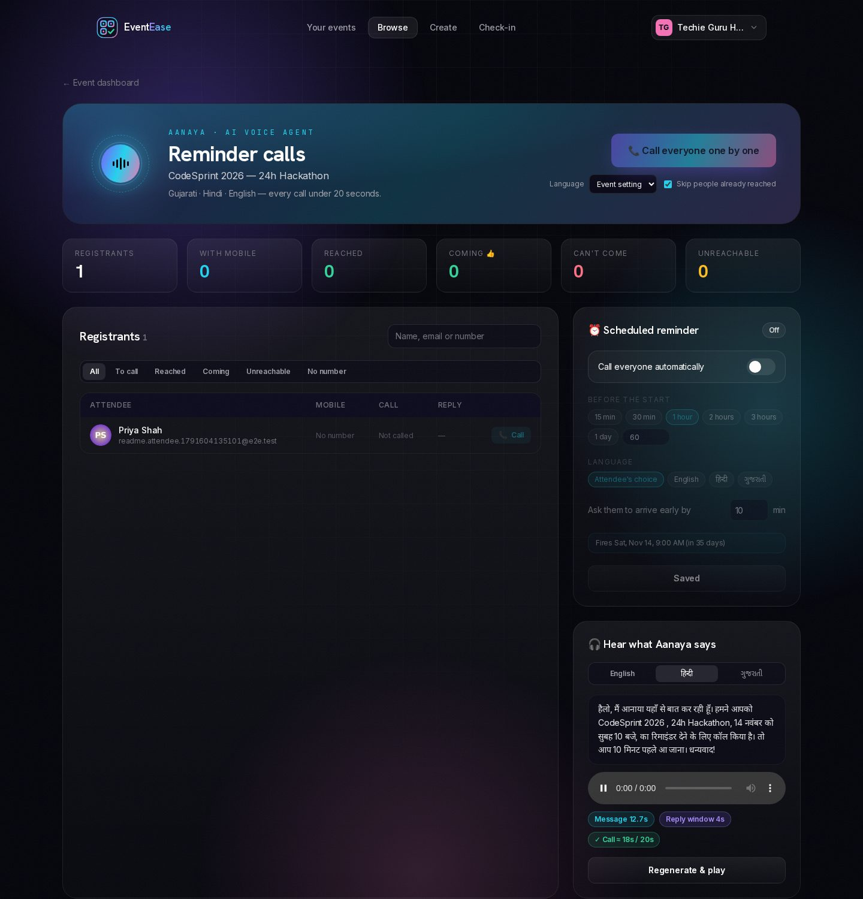

</details>

---

## ✨ Features

### 🎓 For attendees

| Feature                  | What it does                                                                                                  |
| ------------------------ | ------------------------------------------------------------------------------------------------------------- |
| **Own portal**           | Sign up at `/signup`, browse events, hold every ticket at `/dashboard`                                        |
| **One-tap registration** | Name, email and student details come from the profile; email is locked to the signed-in account               |
| **QR ticket**            | A unique code like `EE-7K2M-Q9XD` plus a QR — download as PNG, copy or print                                  |
| **Rich profile**         | Photo, mobile, bio, skills & hobbies chips, college, city, LinkedIn/GitHub, a live card and completeness ring |
| **Call language**        | Choose English, हिन्दी or ગુજરાતી for Aanaya's reminder call                                                  |

### 🧑‍💼 For hosts

| Feature            | What it does                                                                                              |
| ------------------ | --------------------------------------------------------------------------------------------------------- |
| **Own portal**     | Sign up at `/host/signup`; every tool lives under `/host`                                                 |
| **Rich events**    | Kind (Workshop, Hackathon, Competition…), start **and end**, capacity, entry fee, prize list, cover image |
| **Live preview**   | The event card updates as you type; competitions start with a 1st / 2nd / 3rd prize list                  |
| **Edit & delete**  | `/events/:id/edit` keeps registrations intact; delete asks for confirmation                               |
| **Live dashboard** | Registered vs capacity, checked in, seats left, gate results and an activity feed — refreshing on its own |
| **CSV export**     | One-click attendance sheet with formula-injection-safe cells                                              |
| **Reminder calls** | Call one person, everyone one by one, or schedule calls N minutes before the start                        |

### 🚪 At the gate

| Feature                | What it does                                                                                |
| ---------------------- | ------------------------------------------------------------------------------------------- |
| **Three ways to scan** | Camera, a USB barcode scanner in the code field, or a screenshot of the ticket              |
| **Exactly once**       | A ticket is admitted once, even when two gates scan it at the same instant                  |
| **Wrong-event guard**  | Pick the event at the gate: tickets for other events are rejected **without being used up** |
| **Typo-proof codes**   | No `0 O 1 I L`; lower case, spaces and missing dashes are all accepted                      |
| **Rich feedback**      | Colour flash, a 3D portal that turns green or red, sounds (with mute) and phone vibration   |
| **Audit trail**        | Every scan is logged: granted, duplicate, invalid or wrong event                            |

### ♿ Built in everywhere

Keyboard-friendly, semantic markup, screen-reader live regions for verdicts, `prefers-reduced-motion`
support, and **images capped at 300 KB** (big photos are shrunk in the browser, then re-checked on the server).

### ✅ Requirements covered

| Requirement                                                      | How EventEase does it                                                                                                                     |
| ---------------------------------------------------------------- | ----------------------------------------------------------------------------------------------------------------------------------------- |
| Create an event with a participant capacity                      | `/events/new` with live preview. Capacity is validated on the server and enforced in a transaction, so a rush of sign-ups can't overbook  |
| Register participants and generate a unique QR code / entry code | `/events/:id/register` issues an `EE-XXXX-XXXX` code (unique index) and a QR ticket at `/tickets/:code`. One ticket per account per event |
| Verify codes during check-in and prevent duplicate check-ins     | `/checkin`: camera, manual entry or image. Check-in is one conditional update, so a ticket is admitted **exactly once**                   |
| Display registration and attendance counts                       | A live dashboard per event, plus totals on `/events` and the landing page                                                                 |
| **Demo:** register → check in → reject second check-in           | Automated end to end (`npm run test:e2e`) and as an integration test (`npm test`). See the [demo script](#-demo-script-3-minutes)         |

---

## 🔄 How it works

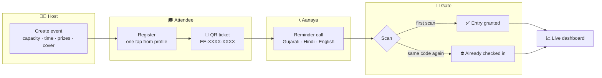
```mermaid
flowchart LR
    subgraph HOST["🧑‍💼 Host"]
        A["Create event<br/>capacity · time · prizes · cover"]
    end
    subgraph ATTENDEE["🎓 Attendee"]
        B["Register<br/>one tap from profile"]
        C["🎫 QR ticket<br/>EE-XXXX-XXXX"]
    end
    subgraph AANAYA["📞 Aanaya"]
        D["Reminder call<br/>Gujarati · Hindi · English"]
    end
    subgraph GATE["🚪 Gate"]
        E{"Scan"}
        F["✅ Entry granted"]
        G["⛔ Already checked in"]
    end
    H["📈 Live dashboard"]

    A --> B --> C --> D --> E
    E -- "first scan" --> F
    E -- "same code again" --> G
    F --> H
    G --> H
```

### 🏗️ Architecture

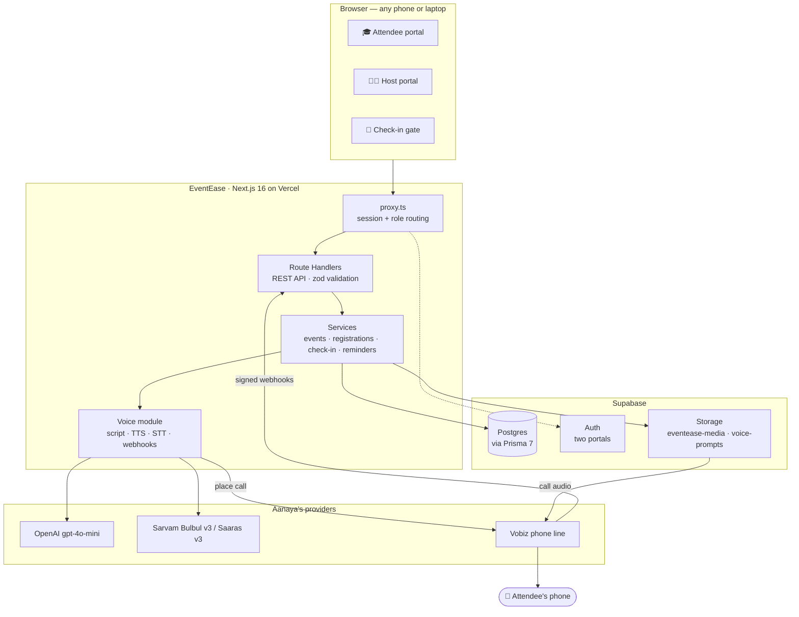
```mermaid
flowchart TB
    subgraph CLIENT["Browser — any phone or laptop"]
        P1["🎓 Attendee portal"]
        P2["🧑‍💼 Host portal"]
        P3["🚪 Check-in gate"]
    end

    subgraph APP["EventEase · Next.js 16 on Vercel"]
        PX["proxy.ts<br/>session + role routing"]
        RH["Route Handlers<br/>REST API · zod validation"]
        SV["Services<br/>events · registrations · check-in · reminders"]
        VO["Voice module<br/>script · TTS · STT · webhooks"]
    end

    subgraph SUPA["Supabase"]
        DB[("Postgres<br/>via Prisma 7")]
        AU["Auth<br/>two portals"]
        ST["Storage<br/>eventease-media · voice-prompts"]
    end

    subgraph VOICE["Aanaya's providers"]
        OA["OpenAI gpt-4o-mini"]
        SA["Sarvam Bulbul v3 / Saaras v3"]
        VB["Vobiz phone line"]
    end

    PH(["📱 Attendee's phone"])

    CLIENT --> PX --> RH --> SV --> DB
    PX -.-> AU
    SV --> ST
    SV --> VO
    VO --> OA
    VO --> SA
    VO -- "place call" --> VB
    VB -- "signed webhooks" --> RH
    VB --> PH
    ST -- "call audio" --> VB
```

### 🔒 Check-in, exactly once

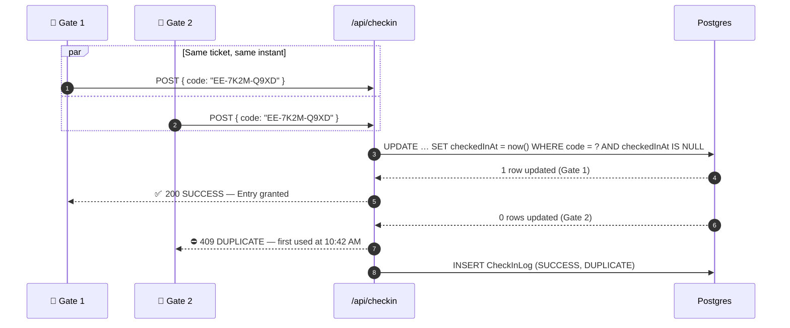
```mermaid
sequenceDiagram
    autonumber
    participant G1 as 🚪 Gate 1
    participant G2 as 🚪 Gate 2
    participant API as /api/checkin
    participant DB as Postgres

    par Same ticket, same instant
        G1->>API: POST { code: "EE-7K2M-Q9XD" }
    and
        G2->>API: POST { code: "EE-7K2M-Q9XD" }
    end
    API->>DB: UPDATE … SET checkedInAt = now() WHERE code = ? AND checkedInAt IS NULL
    DB-->>API: 1 row updated (Gate 1)
    API-->>G1: ✅ 200 SUCCESS — Entry granted
    DB-->>API: 0 rows updated (Gate 2)
    API-->>G2: ⛔ 409 DUPLICATE — first used at 10:42 AM
    API->>DB: INSERT CheckInLog (SUCCESS, DUPLICATE)
```

**The guarantees, and where they live**

| Guarantee                         | How                                                                                                                                   | Proven by                                        |
| --------------------------------- | ------------------------------------------------------------------------------------------------------------------------------------- | ------------------------------------------------ |
| 🎫 **No duplicate check-ins**     | `checkIn()` in `src/lib/services/checkin.ts` is one conditional `UPDATE`: only one request can flip `checkedInAt` from `NULL`         | 12 simultaneous scans → exactly 1 success        |
| 🪑 **No overbooking**             | `registerParticipant()` takes `SELECT … FOR UPDATE` on the event row, then counts and inserts in the same transaction                 | 15 simultaneous sign-ups for 5 seats → 5 tickets |
| 🔗 **Tickets bound to accounts**  | The email always comes from the session, never the request body                                                                       | Integration test                                 |
| 🧱 **No cross-host leaks**        | Participant lists, exports, live counts and the gate are scoped to the owning host; one host can't admit — or burn — another's ticket | Integration test                                 |
| 🔁 **No duplicate registrations** | Unique index on `(eventId, email)`, emails trimmed and lower-cased by zod                                                             | Integration + browser tests                      |
| 🔤 **Unique, typo-proof codes**   | 31-character alphabet, `crypto.getRandomValues` with rejection sampling, unique index with retry                                      | Unit tests                                       |

---

## 📞 Aanaya — AI reminder calls

Aanaya is an outbound voice agent that phones registrants before an event — in **Gujarati, Hindi or
English** — and every call is over in **under 20 seconds**.

> 🗣️ _“हैलो, मैं आनाया यहाँ से बात कर रही हूँ। हमने आपको **CodeSprint 2026**, **14 नवंबर को सुबह 10 बजे**, का रिमाइंडर देने के लिए कॉल किया है। तो आप 10 मिनट पहले आ जाना। धन्यवाद!”_

The host opens **📞 Reminder calls** on an event (`/events/:id/calls`) and can:

- 📱 **Call** one registrant, or **Call everyone one by one** — strictly one call at a time
- ⏰ **Schedule** calls 15 minutes to a day before the start (or any custom minutes)
- 🌐 Use **each attendee's language**, or force one language for a batch
- 🎧 **Hear what Aanaya says** — the exact script and voice, before anyone is dialled
- 👀 Watch each call live and read what the attendee said back: **👍 Coming · ✋ Can't come · 🤔 Unsure**

### One call, end to end

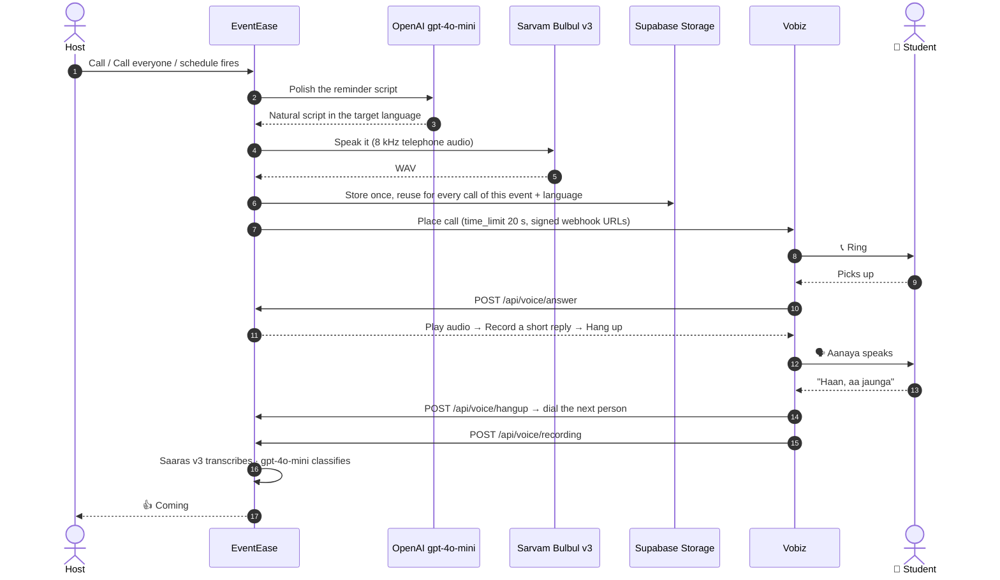
```mermaid
sequenceDiagram
    autonumber
    actor Host
    participant EE as EventEase
    participant AI as OpenAI gpt-4o-mini
    participant TTS as Sarvam Bulbul v3
    participant ST as Supabase Storage
    participant VB as Vobiz
    actor Student as 📱 Student

    Host->>EE: Call / Call everyone / schedule fires
    EE->>AI: Polish the reminder script
    AI-->>EE: Natural script in the target language
    EE->>TTS: Speak it (8 kHz telephone audio)
    TTS-->>EE: WAV
    EE->>ST: Store once, reuse for every call of this event + language
    EE->>VB: Place call (time_limit 20 s, signed webhook URLs)
    VB->>Student: 📞 Ring
    Student-->>VB: Picks up
    VB->>EE: POST /api/voice/answer
    EE-->>VB: Play audio → Record a short reply → Hang up
    VB->>Student: 🗣️ Aanaya speaks
    Student-->>VB: "Haan, aa jaunga"
    VB->>EE: POST /api/voice/hangup → dial the next person
    VB->>EE: POST /api/voice/recording
    EE->>EE: Saaras v3 transcribes · gpt-4o-mini classifies
    EE-->>Host: 👍 Coming
```

### Call status

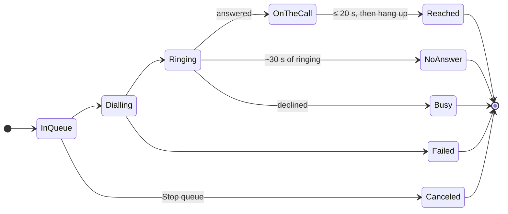
```mermaid
stateDiagram-v2
    direction LR
    [*] --> InQueue
    InQueue --> Dialling
    InQueue --> Canceled: Stop queue
    Dialling --> Ringing
    Ringing --> OnTheCall: answered
    Ringing --> NoAnswer: ~30 s of ringing
    Ringing --> Busy: declined
    OnTheCall --> Reached: ≤ 20 s, then hang up
    Dialling --> Failed
    Reached --> [*]
    NoAnswer --> [*]
    Busy --> [*]
    Failed --> [*]
    Canceled --> [*]
```

| Piece                     | Role                                                                                                            |
| ------------------------- | --------------------------------------------------------------------------------------------------------------- |
| 🗣️ **Sarvam Bulbul v3**   | Aanaya's voice — female speakers, 8 kHz telephone audio                                                         |
| 👂 **Sarvam Saaras v3**   | Transcribes the reply (“haan, aa jaunga”)                                                                       |
| 🧠 **OpenAI gpt-4o-mini** | Makes the script natural and reads the reply. Optional: without it, fixed scripts and keyword matching are used |
| ☎️ **Vobiz**              | The Indian number that places the calls; `time_limit: 20` cuts every call at 20 s                               |
| 🌐 **ngrok**              | Public HTTPS tunnel so Vobiz can reach the webhooks during local development                                    |

**Safe by design**

- 🔏 Every webhook URL carries an HMAC of its call id; Vobiz's own signature is checked when present. Forged requests get `403`.
- 🛡️ If gpt-4o-mini's script is off (wrong language, wrong name, too long), the fixed template is used instead.
- ⏳ Calls that never report back are marked failed after a while, so a queue can't get stuck.
- 🚫 Seed data never contains phone numbers — they would belong to real people.

---

## 🗃️ Data model

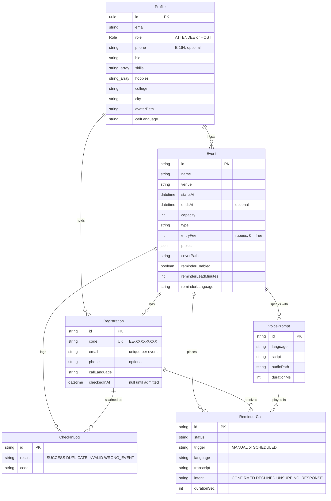
```mermaid
erDiagram
    Profile ||--o{ Event : hosts
    Profile ||--o{ Registration : holds
    Event ||--o{ Registration : has
    Event ||--o{ CheckInLog : logs
    Registration ||--o{ CheckInLog : "scanned as"
    Event ||--o{ VoicePrompt : "speaks with"
    Event ||--o{ ReminderCall : places
    Registration ||--o{ ReminderCall : receives
    VoicePrompt ||--o{ ReminderCall : "played in"

    Profile {
        uuid id PK
        string email
        Role role "ATTENDEE or HOST"
        string phone "E.164, optional"
        string bio
        string_array skills
        string_array hobbies
        string college
        string city
        string avatarPath
        string callLanguage
    }
    Event {
        string id PK
        string name
        string venue
        datetime startsAt
        datetime endsAt "optional"
        int capacity
        string type
        int entryFee "rupees, 0 = free"
        json prizes
        string coverPath
        boolean reminderEnabled
        int reminderLeadMinutes
        string reminderLanguage
    }
    Registration {
        string id PK
        string code UK "EE-XXXX-XXXX"
        string email "unique per event"
        string phone "optional"
        string callLanguage
        datetime checkedInAt "null until admitted"
    }
    CheckInLog {
        string id PK
        string result "SUCCESS DUPLICATE INVALID WRONG_EVENT"
        string code
    }
    ReminderCall {
        string id PK
        string status
        string trigger "MANUAL or SCHEDULED"
        string language
        string transcript
        string intent "CONFIRMED DECLINED UNSURE NO_RESPONSE"
        int durationSec
    }
    VoicePrompt {
        string id PK
        string language
        string script
        string audioPath
        int durationMs
    }
```

---

## 🧰 Tech stack

| Layer      | Choice                                                                                                                               |
| ---------- | ------------------------------------------------------------------------------------------------------------------------------------ |
| Framework  | **Next.js 16** (App Router, Cache Components / Partial Prerendering, Route Handlers), **React 19**, **TypeScript**                   |
| 3D         | **three.js** + **@react-three/fiber** + **drei** — a voxel QR hero that assembles and scatters on scroll, plus the check-in portal   |
| Animation  | **anime.js v4** — scroll-synced reveals that reverse on scroll-up, split text, line drawing, count-ups, magnetic buttons, tilt cards |
| Styling    | **Tailwind CSS v4**, glassmorphism, **Inter** / **Hanken Grotesk** / **JetBrains Mono**                                              |
| Database   | **Supabase Postgres** via **Prisma ORM 7** (`@prisma/adapter-pg`)                                                                    |
| Auth       | **Supabase Auth** — attendee and host portals, sessions via `@supabase/ssr` cookies                                                  |
| Storage    | **Supabase Storage** — `eventease-media` (images ≤ 300 KB) and `voice-prompts` (call audio)                                          |
| Voice      | **Sarvam** Bulbul v3 + Saaras v3, **OpenAI** gpt-4o-mini, **Vobiz** calls, **ngrok** tunnel in development                           |
| QR         | `qrcode` to generate; native `BarcodeDetector` with a `jsQR` fallback to scan                                                        |
| Validation | **zod**, shared by the browser and the server                                                                                        |
| Testing    | Node test runner (unit + integration) and **Playwright** (browser journeys)                                                          |
| Hosting    | **Vercel**                                                                                                                           |

---

## 🚀 Quick start

**You need:** Node.js `20.19+`, `22.12+` or `24+`, npm, and a Supabase project.

```bash
cp .env.example .env   # fill in your Supabase connection strings and keys
npm install            # also generates the Prisma client
npm run db:deploy      # applies migrations to Supabase
npm run storage:setup  # creates the storage buckets (300 KB image limit)
npm run db:seed        # demo events, participants and accounts
npm run dev            # http://localhost:3000
```

> [!WARNING]
> `npm run db:seed`, `npm run setup` and `npm run db:reset` **wipe the database `DATABASE_URL` points at**.
> As a safety catch, seeding refuses when the database has real accounts, and `db:reset` always asks
> first — add `SEED_WIPE=yes` in front only when you truly mean to wipe it.

See [DEPLOYMENT.md](DEPLOYMENT.md) for the full Supabase + Vercel setup, including the pooler
connection string Vercel needs.

### 🔑 Demo accounts (after seeding)

| Portal      | Sign in at     | Email                  | Password       |
| ----------- | -------------- | ---------------------- | -------------- |
| 🧑‍💼 Host     | `/host/signin` | `host@eventease.demo`  | `eventease123` |
| 🎓 Attendee | `/signin`      | `aisha@eventease.demo` | `eventease123` |
| 🎓 Attendee | `/signin`      | `rahul@eventease.demo` | `eventease123` |

The seed has four events (one live with check-ins, one full), about 290 participants and some gate history.

### 🚪 Two portals

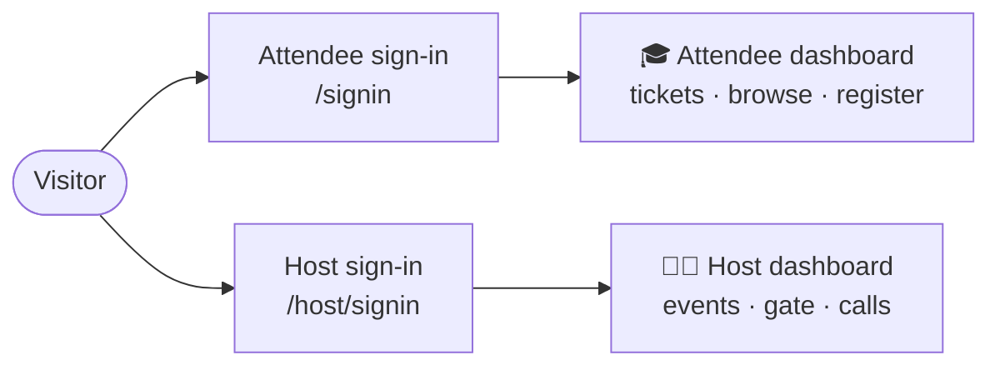
```mermaid
flowchart LR
    V(["Visitor"]) --> S1["Attendee sign-in<br/>/signin"]
    V --> S2["Host sign-in<br/>/host/signin"]
    S1 --> D1["🎓 Attendee dashboard<br/>tickets · browse · register"]
    S2 --> D2["🧑‍💼 Host dashboard<br/>events · gate · calls"]
```

Nobody can create an event or register without signing in, and each account is turned away at the
other portal's door.

---

## 📞 Local development with reminder calls

Vobiz has to reach your laptop, so local calls go through an **ngrok** tunnel. One command starts both:

```bash
# .env — see .env.example for every option
SARVAM_API_KEY=...                                  # dashboard.sarvam.ai
OPENAI_API_KEY=...                                  # optional
VOBIZ_AUTH_ID=...  VOBIZ_AUTH_TOKEN=...  VOBIZ_FROM_NUMBER=918071234567
NGROK_AUTHTOKEN=...  NGROK_DOMAIN=your-name.ngrok-free.dev   # dashboard.ngrok.com — free static domain

npm run dev:calls
```

```text
Port 3000 is busy, so EventEase runs on 3001.

  ▸ EventEase   http://localhost:3001
  ▸ Webhooks    https://your-name.ngrok-free.dev  (Vobiz → this machine)
```

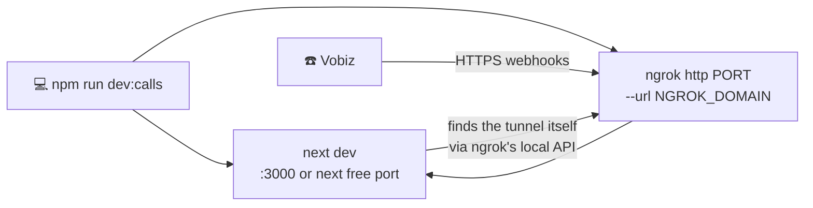
```mermaid
flowchart LR
    DEV["💻 npm run dev:calls"] --> NX["next dev<br/>:3000 or next free port"]
    DEV --> NG["ngrok http PORT<br/>--url NGROK_DOMAIN"]
    VB["☎️ Vobiz"] -- "HTTPS webhooks" --> NG --> NX
    NX -- "finds the tunnel itself<br/>via ngrok's local API" --> NG
```

- 🔍 The app finds the tunnel on its own, so `PUBLIC_BASE_URL` stays empty locally. Set it in production.
- ✅ The call console shows a **checklist** of anything still missing.
- ⏰ Locally the server runs the reminder scheduler every 30 s. Set `REMINDER_SCHEDULER=off` to stop it. In production, point a cron at `GET /api/cron/reminders` every minute with `Authorization: Bearer $CRON_SECRET` (Vercel Hobby only allows daily crons, so use an external one).
- 🧩 Separate terminals work too: `npm run dev` + `npm run tunnel` (add `PORT=3001` to both when 3000 is taken).
- ☎️ You don't have to change the Answer/Hangup URLs in the Vobiz console: EventEase sends signed URLs with every call.
- 📲 To get called as Aisha in the demo data, set `DEMO_PHONE` to **your own** number before seeding.

---

## 🎬 Demo script (3 minutes)

Use two windows: the **host** in a normal window, the **attendee** in an incognito one.

| #   | Who         | Do this                                                                               | You see                                                           |
| --- | ----------- | ------------------------------------------------------------------------------------- | ----------------------------------------------------------------- |
| 1   | 👀 Anyone   | Open `/` and scroll slowly, then back up                                              | The 3D QR bursts apart, sections reveal — and everything reverses |
| 2   | 🧑‍💼 Host     | **Create** → name, venue, date, kind **Hackathon**, capacity **2** → **Create event** | The preview card updates as you type; the event dashboard opens   |
| 3   | 🧑‍💼 Host     | **Copy registration link**                                                            | "Link copied!"                                                    |
| 4   | 🎓 Attendee | Open the link → sign up → **Register & get my QR ticket**                             | Confetti, then a QR ticket with a unique `EE-XXXX-XXXX` code      |
| 5   | 🧑‍💼 Host     | **Open check-in gate** → pick the event → type the code → **Verify & check in**       | ✅ **Entry granted**, with the attendee's name                    |
| 6   | 🧑‍💼 Host     | Press **Verify & check in** again                                                     | ⛔ **Already checked in** — with the time it was first used       |
| 7   | 🧑‍💼 Host     | Back on the event dashboard                                                           | 1 / 2 registered, 1 checked in, 1 duplicate blocked               |
| 8   | 🧑‍💼 Host     | **📞 Reminder calls** → **🎧 Generate Hindi preview**                                 | Aanaya's exact script and voice, under 20 s                       |

> 📷 **Camera scanning:** on the gate, use **Scan QR** and point the camera at the ticket on another
> screen, or **Scan from an image** with the ticket's downloaded QR PNG.

---

## 🔌 REST API

Every write endpoint needs a signed-in session cookie, and host endpoints only work for the event's owner.

<details>
<summary><b>Events, registrations and check-in</b></summary>

| Method   | Endpoint                        | Description                                                                                           |
| -------- | ------------------------------- | ----------------------------------------------------------------------------------------------------- |
| `GET`    | `/api/events`                   | All events with registration and attendance stats                                                     |
| `POST`   | `/api/events`                   | Create `{ name, venue, startsAt, endsAt?, capacity, type, entryFee, prizes, description?, … }` · host |
| `GET`    | `/api/events/:id`               | One event with stats                                                                                  |
| `PATCH`  | `/api/events/:id`               | Edit (same fields as create) · owner                                                                  |
| `DELETE` | `/api/events/:id`               | Delete with its registrations and logs · owner                                                        |
| `PUT`    | `/api/events/:id/cover`         | Upload the cover (multipart `file`, ≤ 300 KB); `DELETE` removes it · owner                            |
| `GET`    | `/api/events/:id/registrations` | Participants + stats · owner                                                                          |
| `POST`   | `/api/events/:id/registrations` | Register `{ name, studentId?, department?, phone?, callLanguage? }` → `201` with the code · attendee  |
| `GET`    | `/api/events/:id/live`          | Stats, gate counts, participants, recent activity (polled by the dashboard) · owner                   |
| `GET`    | `/api/events/:id/export`        | Attendance CSV · owner                                                                                |
| `POST`   | `/api/checkin`                  | Verify `{ code, eventId? }` → `200 SUCCESS`, `409 DUPLICATE`, `409 WRONG_EVENT`, `404 INVALID` · host |
| `GET`    | `/api/tickets/:code`            | Ticket lookup · its holder                                                                            |
| `GET`    | `/api/tickets/:code/qr`         | QR PNG (`?download` to save)                                                                          |
| `GET`    | `/api/stats`                    | Totals across all events                                                                              |

</details>

<details>
<summary><b>Profiles</b></summary>

| Method      | Endpoint              | Description                                       |
| ----------- | --------------------- | ------------------------------------------------- |
| `GET`/`PUT` | `/api/profile`        | Your profile; `PUT` updates it                    |
| `PUT`       | `/api/profile/avatar` | Upload your photo (≤ 300 KB); `DELETE` removes it |

</details>

<details>
<summary><b>Aanaya</b></summary>

| Method | Endpoint                                              | Description                                                                                        |
| ------ | ----------------------------------------------------- | -------------------------------------------------------------------------------------------------- |
| `GET`  | `/api/events/:id/calls`                               | Registrants with mobile numbers and call status · owner                                            |
| `POST` | `/api/events/:id/calls`                               | Queue calls `{ registrationIds?, language?, skipReached? }`; `DELETE` stops the queue · owner      |
| `PUT`  | `/api/events/:id/reminders`                           | Schedule `{ reminderEnabled, reminderLeadMinutes, reminderLanguage, reminderArriveEarly }` · owner |
| `POST` | `/api/events/:id/reminders/preview`                   | `{ language }` → the exact script and audio Aanaya will play · owner                               |
| `GET`  | `/api/cron/reminders`                                 | One scheduler pass (`Authorization: Bearer $CRON_SECRET`)                                          |
| `POST` | `/api/voice/answer` · `ring` · `hangup` · `recording` | Vobiz webhooks — signed URLs only                                                                  |

</details>

---

## 🧪 Testing

```bash
npm test                                              # 46 unit + integration tests, ~40 s
npm run dev:calls                                     # terminal 1 — note the port
E2E_BASE_URL=http://localhost:3001 npm run test:e2e   # terminal 2 — 5 browser journeys, ~1.5 min
```

| Suite                        | What it checks                                                                                                           |
| ---------------------------- | ------------------------------------------------------------------------------------------------------------------------ |
| `tests/codes.test.mts`       | Code format, no look-alike characters, uniqueness, normalising sloppy input                                              |
| `tests/voice.test.mts`       | Phone numbers, spoken times, reminder scripts, reply keywords, the 20-second budget, signatures, validation, time ranges |
| `tests/services.test.mts`    | Capacity under a rush, exactly-once check-in at several gates, wrong-event guard, cross-host isolation                   |
| `tests/e2e/demo.spec.ts`     | The core demo across both portals, and a host turned away at the attendee door                                           |
| `tests/e2e/features.spec.ts` | Access gates and forged webhooks, a full profile with a 300 KB photo, a rich event through to Aanaya's preview           |

- 🧹 Both suites **clean up after themselves** — accounts, events, registrations, logs, uploaded images and call audio. **No test ever places a phone call.**
- 📋 Manual acceptance tests: **[docs/UAT.md](docs/UAT.md)** — 159 cases across 12 suites.
- 🗑️ After a manual session with `@e2e.test` accounts, `npm run test:cleanup` removes everything they made.

---

## 🗂️ Project structure

```text
prisma/                 schema, migrations, seed
scripts/                dev-calls.mjs · tunnel.mjs · setup-storage.mts · confirm-wipe.mjs
src/
├── app/                pages (App Router) + REST route handlers under api/
│   ├── api/voice/      Vobiz webhooks: answer · ring · hangup · recording
│   ├── api/cron/       reminder scheduler
│   ├── events/[id]/    dashboard · register · edit · calls
│   └── profile/        rich profiles
├── components/
│   ├── three/          HeroScene (voxel QR), PortalScene (check-in gate)
│   ├── motion/         anime.js primitives: Reveal, SplitText, CountUp, Magnetic, TiltCard, Marquee
│   ├── checkin/        gate console, QR scanner, verdict card, sound and haptics
│   ├── calls/          Aanaya's call console
│   ├── dashboard/      live dashboard, participants table, activity feed
│   ├── profile/        profile form and live card
│   └── events/ tickets/ home/ layout/ ui/
├── lib/
│   ├── services/       events · registrations · check-in · live data · media · profiles · reminders
│   ├── voice/          agent · script · Sarvam · OpenAI · Vobiz · webhooks · signatures
│   ├── codes.ts        entry-code generation and normalising
│   └── validation.ts   zod schemas shared by browser and server
└── proxy.ts            session refresh and portal routing
tests/                  node:test suites + Playwright journeys
docs/                   UAT.md · screenshots
```

---

## 📜 Scripts

| Script                                  | What it does                                                               |
| --------------------------------------- | -------------------------------------------------------------------------- |
| `npm run dev`                           | Start the dev server                                                       |
| `npm run dev:calls`                     | Dev server + ngrok tunnel together, for reminder calls locally             |
| `npm run tunnel`                        | Just the ngrok tunnel (`NGROK_DOMAIN`) — the public URL for Vobiz webhooks |
| `npm run dev:https`                     | Dev server over HTTPS (needed for the camera on other devices)             |
| `npm run build` / `npm start`           | Production build / serve                                                   |
| `npm run db:deploy`                     | Apply migrations to Supabase                                               |
| `npm run db:seed`                       | ⚠️ Reset to demo data — wipes it; refuses if there are real accounts       |
| `npm run db:migrate`                    | Create a migration after editing the schema                                |
| `npm run db:studio`                     | Browse the database in Prisma Studio                                       |
| `npm run storage:setup`                 | Create / update the Supabase Storage buckets and their limits              |
| `npm test`                              | Unit + integration tests (against `DATABASE_URL`; cleans up after itself)  |
| `npm run test:e2e`                      | Playwright browser journeys (run `npx playwright install chromium` once)   |
| `npm run test:cleanup`                  | Delete every `@e2e.test` account and all it created                        |
| `npm run lint` / `typecheck` / `format` | Code quality                                                               |

---

## 📝 Notes

- 📷 **Camera on phones:** browsers only allow the camera on `https://` or `localhost`. To scan with a phone on the same Wi-Fi, run `npm run dev:https` and open the "Network" URL it prints (accept the self-signed certificate). Next.js may ask you to add that address to [`allowedDevOrigins`](https://nextjs.org/docs/app/api-reference/config/next-config-js/allowedDevOrigins) in `next.config.ts`.
- 🕒 **Time zone:** set `NEXT_PUBLIC_TIMEZONE` (e.g. `Asia/Kolkata`) so every time on screen and in calls uses the venue's zone.
- ☁️ **Deploying:** see [DEPLOYMENT.md](DEPLOYMENT.md). Vercel must use Supabase's transaction pooler — its functions can't reach the IPv6-only direct host.

---

## 🗺️ Roadmap

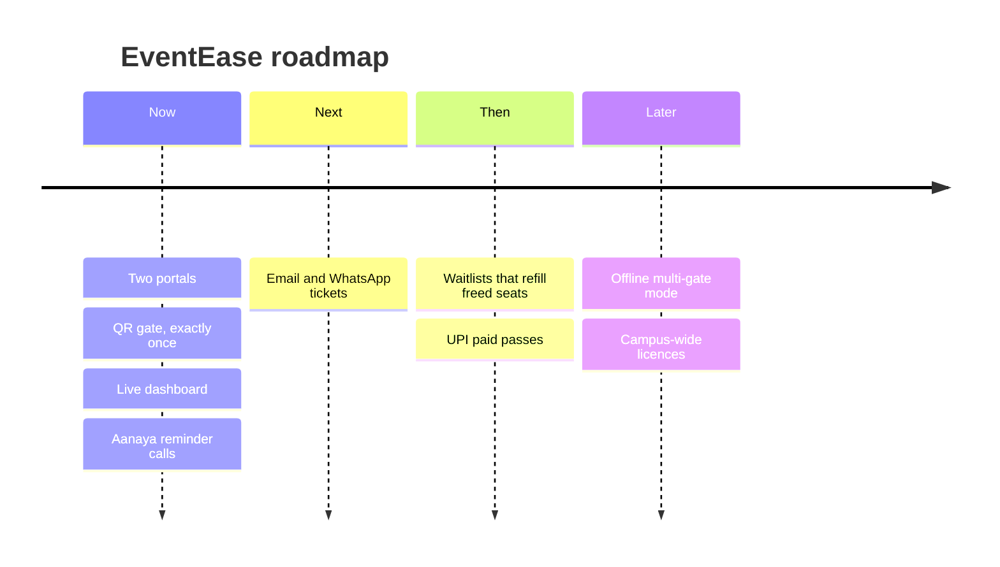
```mermaid
timeline
    title EventEase roadmap
    Now : Two portals : QR gate, exactly once : Live dashboard : Aanaya reminder calls
    Next : Email and WhatsApp tickets
    Then : Waitlists that refill freed seats : UPI paid passes
    Later : Offline multi-gate mode : Campus-wide licences
```

---

<div align="center">

Built by **Team Techie Guru** 🧡

**[Try the live demo →](https://event-ease-zeta-sage.vercel.app/)**

</div>
